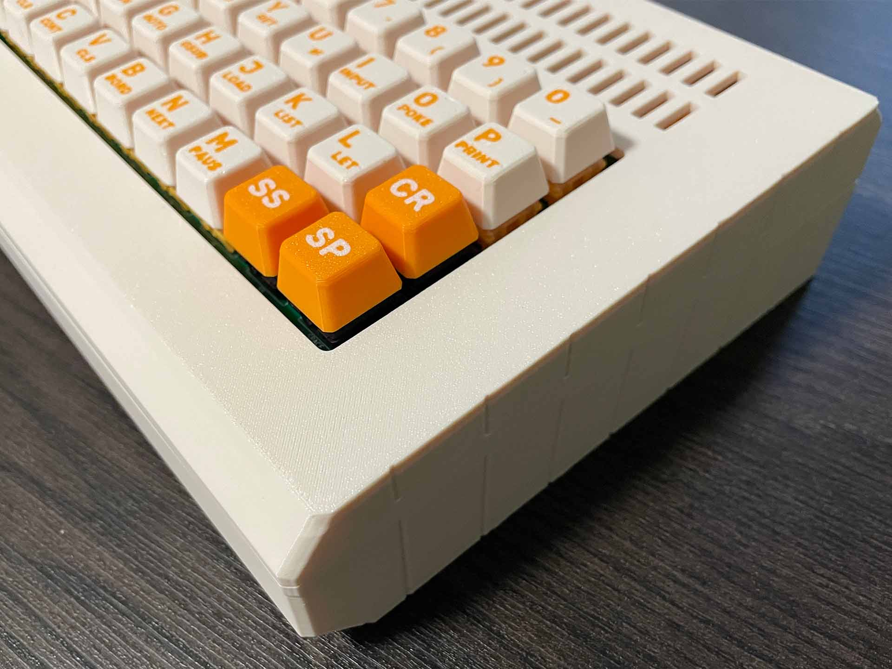
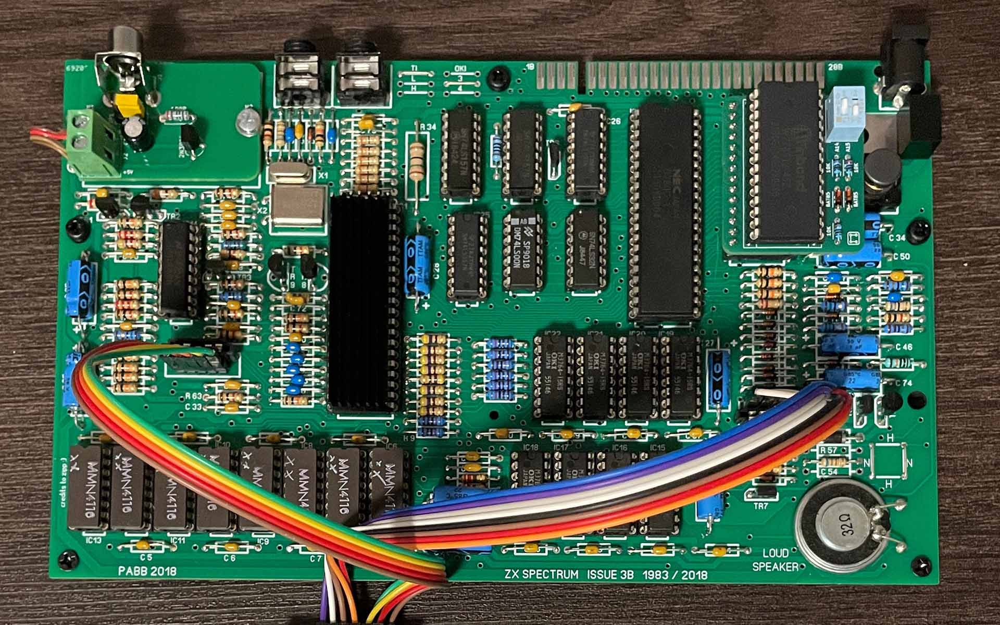
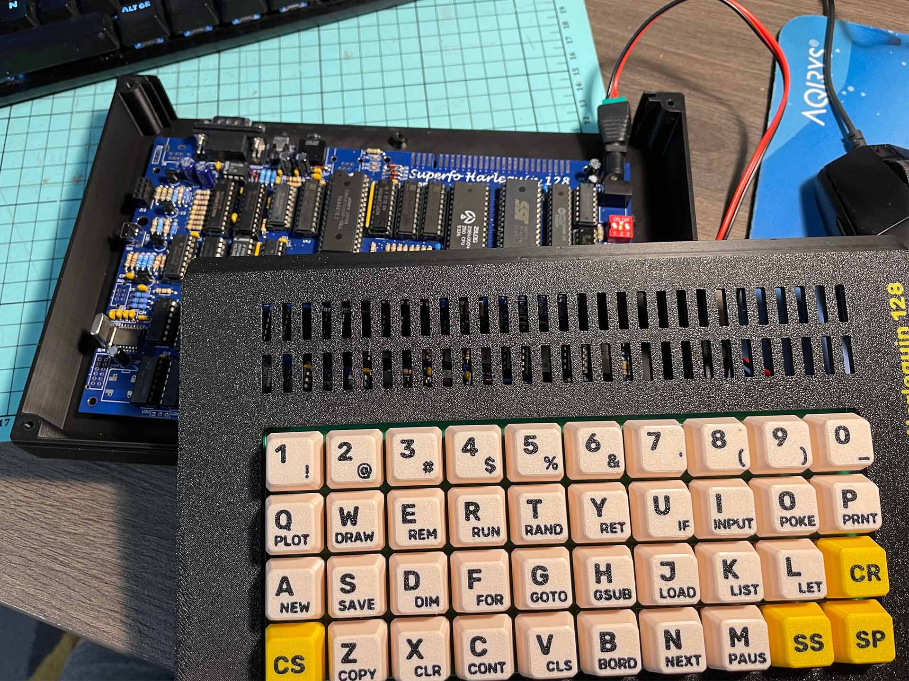
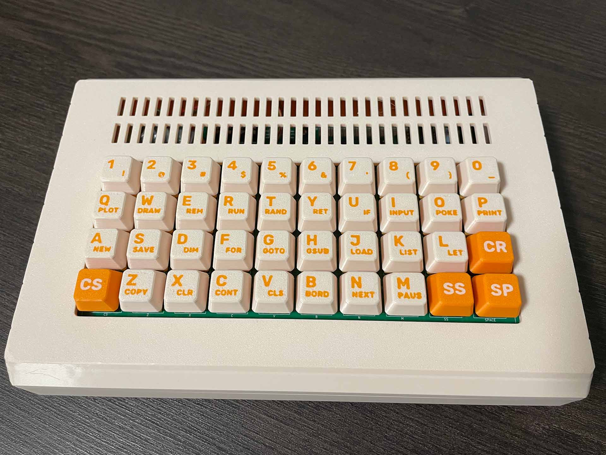
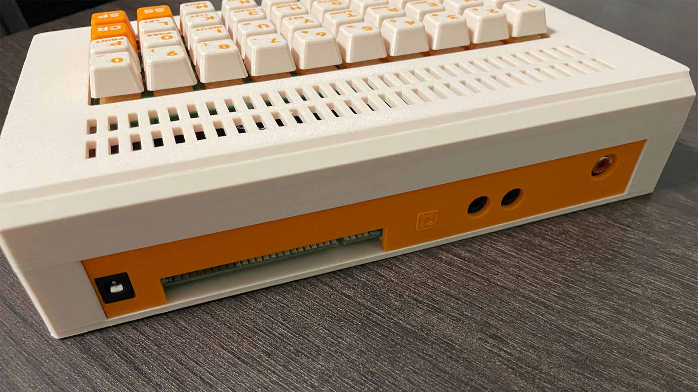
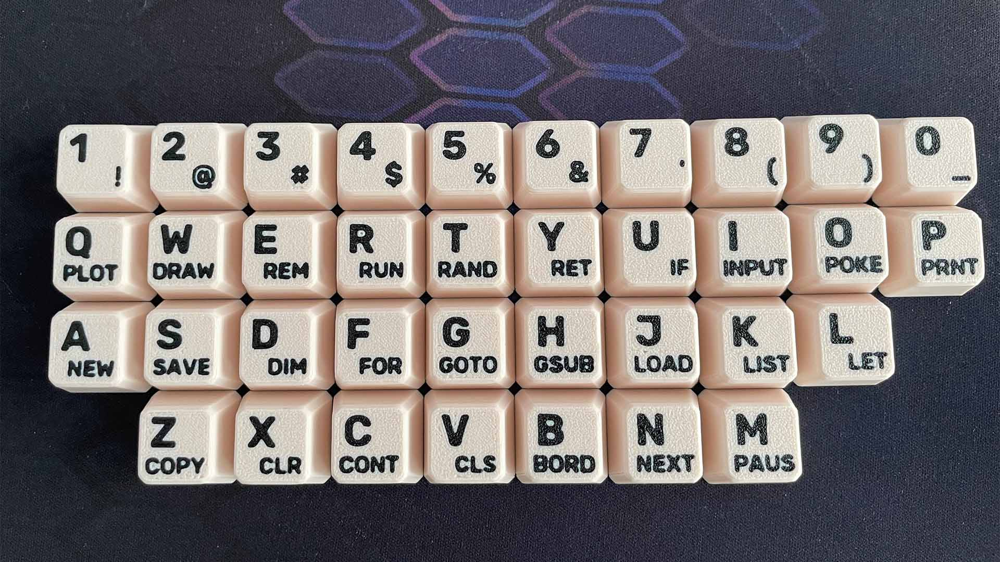
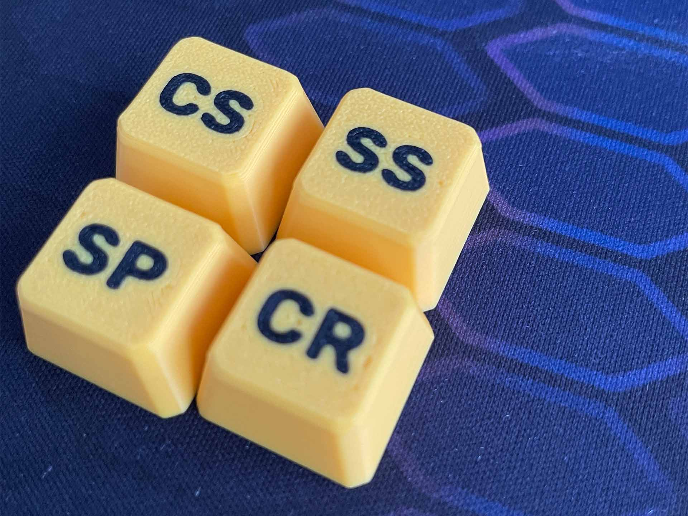
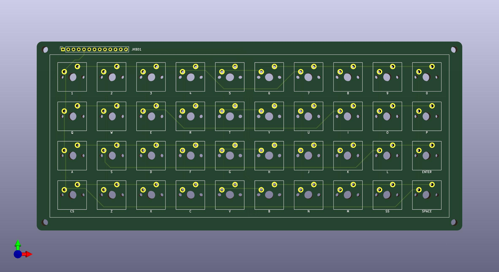
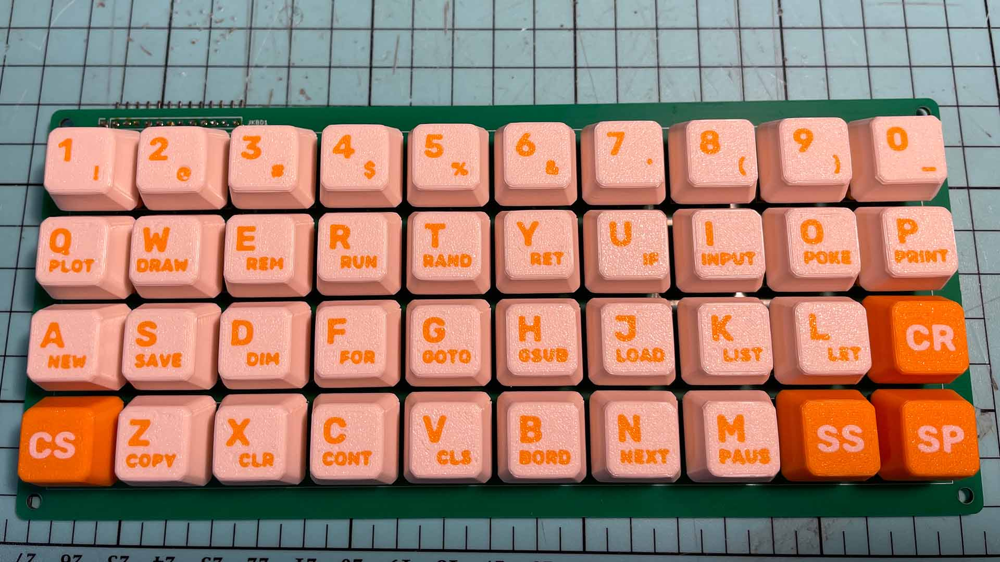

# ZX Spectrum 48k custom case, keyboard and keycaps

A custom 3D-printed case, keycap set, and keyboard PCB for the ZX Spectrum 48K.

## Why

This started with a ULA chip I had sitting around doing nothing, and a friend who handed me a [PABB Issue 3B PCB](https://www.pcbway.com/project/shareproject/ZX_Spectrum_48_Issue_3B_Redrawn.html). One thing led to another, and the mainboard needed a case and a keyboard to go with it — so I designed both from scratch, along with a few other addons along the way.

## Compatibility

The case is designed around the classic ZX Spectrum 48K PCB footprint and mounting hole layout. It's compatible with:

- Original ZX Spectrum 48K
- ZX Spectrum 48K+
- Any clone board sharing the same PCB size and mounting hole layout (confirmed working with the **Harlequin 128**)

The case is built to be tall enough to accomodate my mods. For example the [ZX Spectrum 27C512 EPROM Adapter](https://github.com/r0b0t1cu/ZX-Spectrum-27C512-EPROM-Adapter).

## What's included

### Case (`/case`)
A simplified, more angular take on the classic Spectrum enclosure, split into three printed parts: bottom shell, back plate, and top. A separate top variant is included for builds using a Harlequin 128 board.

The back plate is modeled to fit the [ZX-Spectrum-AV-Adapter](https://github.com/r0b0t1cu/ZX-Spectrum-AV-Adapter), not the stock Spectrum TV-out connector.

- `FREECAD/` — native FreeCAD source files
- `STEP/` — STEP exports
- `STL/` — ready-to-slice STL files

### Keycaps (`/keycaps`)
Full Spectrum 48K keycap set (letters, numbers, and CS/SS/SP/CR), modeled individually for two-color printing — each key has a separate body and legend (text) piece. Legends use the [Rubik](https://fonts.google.com/specimen/Rubik) typeface.

- `FREECAD/` — native FreeCAD source files, one per key
- `STEP/` — STEP exports
- `STL/` — one `-Body.stl` and one `-Text.stl` per key, for multi-material/multi-color printing
- `3MF/` — pre-arranged print-ready project files with color separation already set up (a Bambu Lab A1-specific version and a generic version)

### Keyboard PCB (`/keyboard-pcb`)
A custom keyboard PCB for use with Cherry MX (and compatible) switches.

Full KiCad project included, plus a fabrication-ready production folder (BOM, CPL, netlist, Gerbers) for ordering directly from a fab house such as JLCPCB.

## 3D Printing

- **Material:** PLA
- **Layer height:** 0.2 mm
- **Infill:** 15%
- **Orientation:** flat side down
- **Supports:** a few small supports needed

## Assembly

Case parts are held together with **M3 screws** — all mounting holes are sized for M3.

## Credits & licenses

- All files in this repository (case, keycaps, keyboard PCB) are released under the **MIT License** — see [LICENSE](LICENSE).
- Keycap legends use the **Rubik** typeface by Google Fonts, licensed under the [SIL Open Font License](https://fonts.google.com/specimen/Rubik).
- This case and keyboard are designed to fit a ZX Spectrum 48K mainboard such as [PABB's Issue 3B redraw](https://www.pcbway.com/project/shareproject/ZX_Spectrum_48_Issue_3B_Redrawn.html), which is a **separate project licensed CC BY-NC-SA** and is *not* included or redistributed here.

## Related projects

- [ZX-Spectrum-AV-Adapter](https://github.com/r0b0t1cu/ZX-Spectrum-AV-Adapter) — custom composite video mod
- [ZX-Spectrum-27C512-EPROM-Adapter](https://github.com/r0b0t1cu/ZX-Spectrum-27C512-EPROM-Adapter) — custom EPROM adapter
